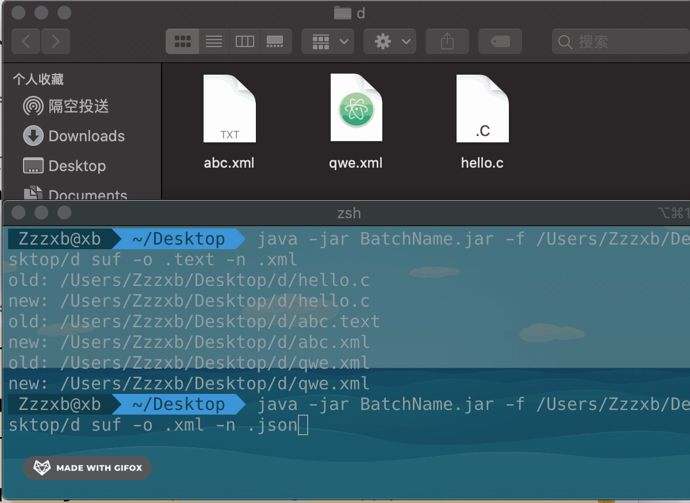
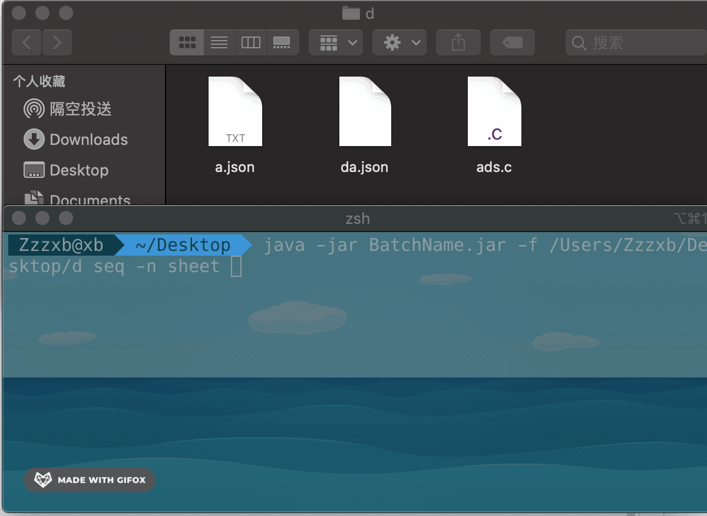
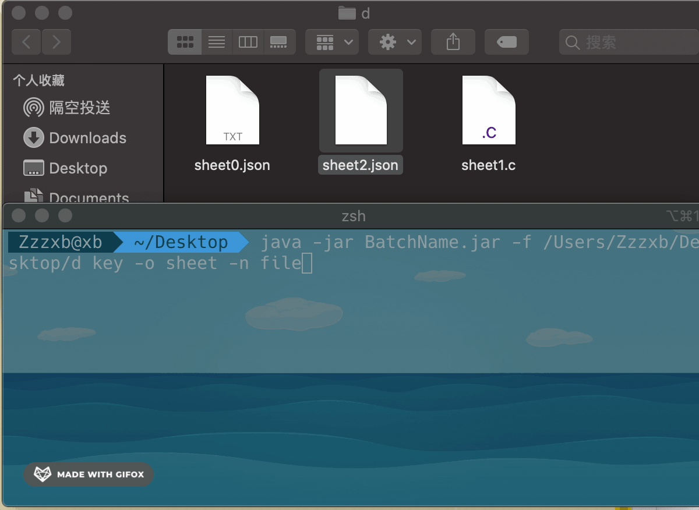
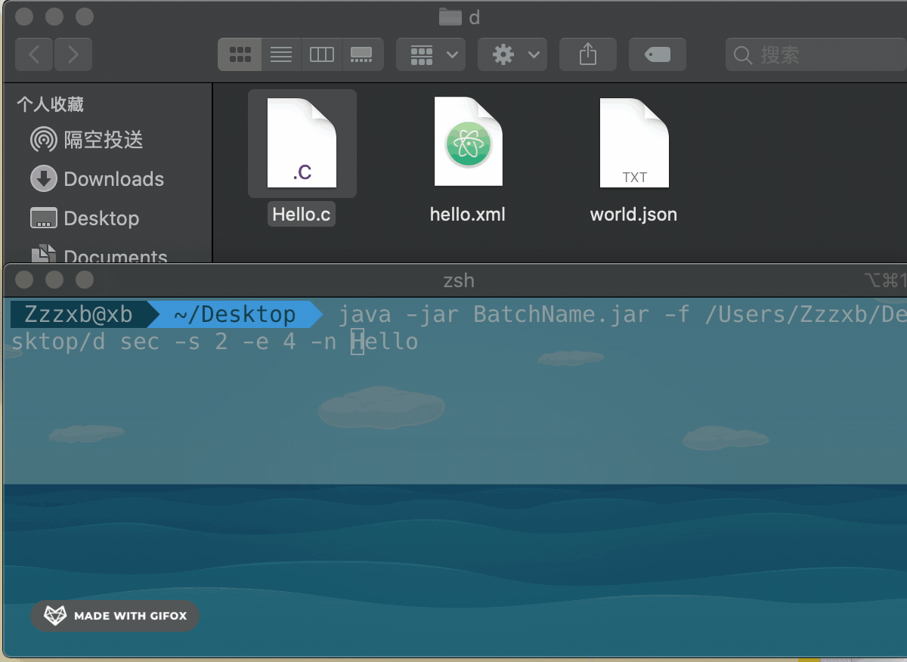

# Batch Name

批量文件重命名

1. 后缀替换

    `java -jar BatchName.jar -d DirPath suf -o oldSuf -n newSuf`
    
    
    
2. 序列命名

    `java -jar BatchName.jar -d DirPath seq -n newName`
    
    
    
3. 关键字替换

    `java -jar BatchName.jar -d DirPath key -o oldKey -n newKey`
    
    
    
4. 区间替换

    `java -jar BatchName.jar -d DirPath sec -s StarNum -e EndNum -n newStr`
    
    
    
>ps 代码又是一堆，想到哪写到哪，千万别看代码,烂的很。
